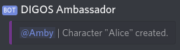
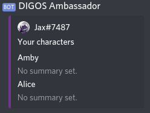
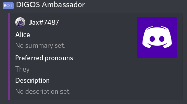
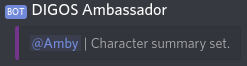

Creating your first character
=============================

Creating your first character is dead easy! We'll be working with the [Character Module](../../modules/character.md) in
this tutorial, so if you want to know more details about any command, you can look it up in the module (either here on
the website, or in the bot itself by using the [help command](../help/usage.md)).

The first step is to pick a name for your character. This is what you'll be using to refer to the character in later
commands, such as setting the character's Discord nickname or avatar.

```
!ch create Alice
```



Whenever you're working with a character (such as changing its name, or becoming it), you'll be referring to it via this 
name. We can view our existing characters with the `!ch list` command.

```
!ch list
```



You can also look at the character directly.

```
!ch show Alice
```



Setting properties is done by using the base command `!ch set` and telling it what to set. So, for example, if we wanted
to give our character a summary, we'd use

```
!ch set summary Alice "My first character!"
```



Notice how the summary is in quotes. This is needed whenever a value has a space in it somewhere.
